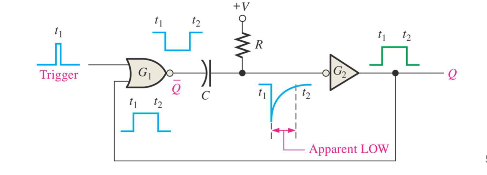
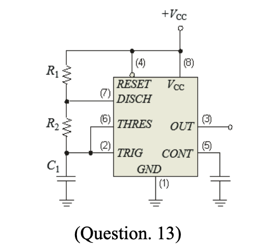
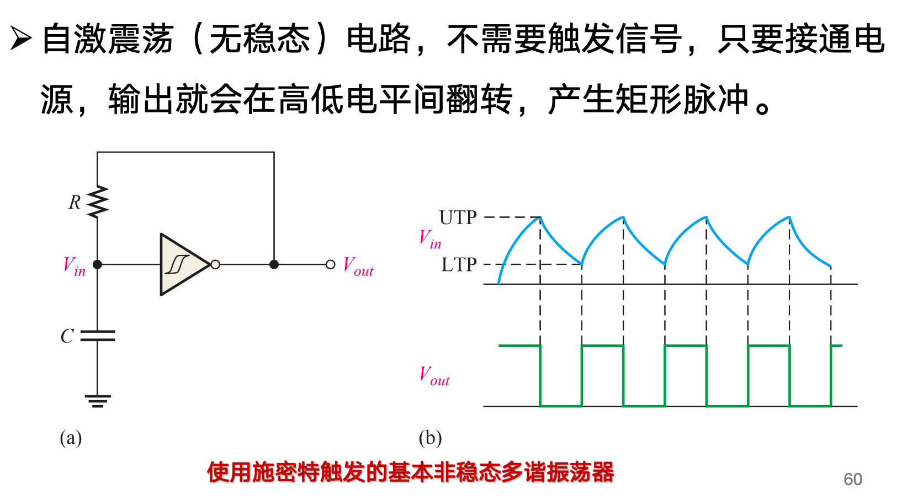

1. 锁存器一般就是顶多加个门控的（两个与非门），后续再升级我们管他叫触发器，与非是低电平有效一般
2. 触发器，边沿触发器
- SR
- D
- JK
- T
SR特性方程
3. 触发器运算特性：$t_{plh}$/$t_{phl}$/$t_{s}$/$t_{h}$，分别对应两种传输延迟时间/建立时间和保持时间。

### 几个时间
- 传输延迟时间
输入信号（CLK/PRE/CLR）到Q发生变化的时间间隔

- 建立时间：setup time
触发信号（D/JK）需提前CLK脉冲触发到达期望位置的时间

- 保持时间：
从CLK脉冲触发开始到触发信号保持期望值的时间。

### 非稳态和单稳态

- 单稳态触发器（脉冲宽度和RC时间常数有关

这里是不可重复触发的。

- 非稳态多谐振荡器

充电过程（高电平）：0.7（R1+R2）C1

放电过程（低电平）：0.7*R2*C1

主要是引脚7会在放电过程中接地。

