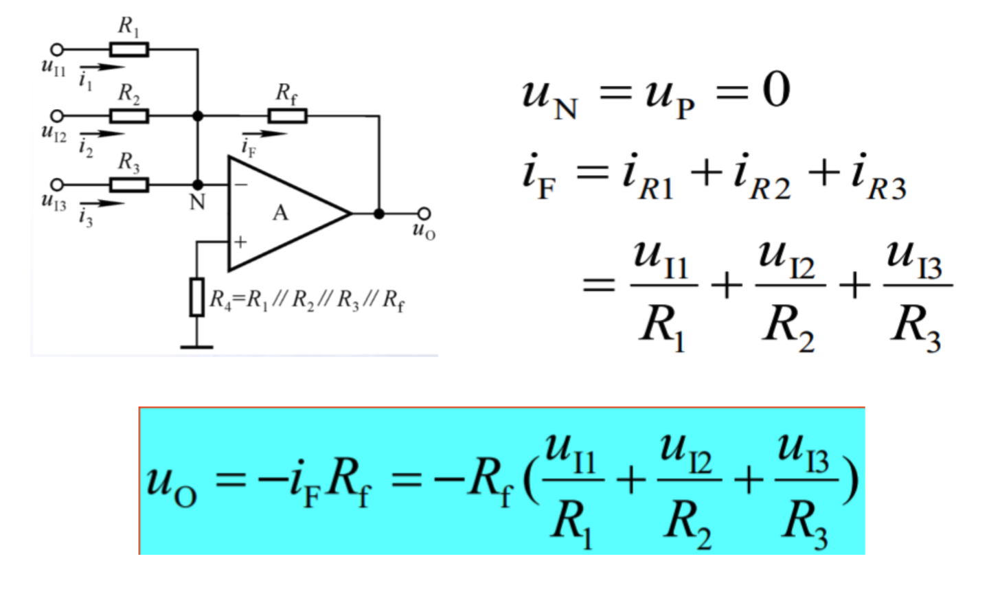

### 运算放大器

开环比较时：两个输入，正集电压大则输出1，负集大则输出0。
闭环时，电压如上图所示，所以可用于放大。

### A/D转换器
模数转换：采样->保持->量化->编码
- 并行快速比较型：速度最快，但是需要的比较器指数级增长（一条线，加电阻然后放比较器那种
需要一个n位的，就需要2^n-1个比较器。
- 逐次渐进型：速度中等，比较时间固定，应用最广泛（从最高位往下一次次放砝码那种
- 双积分型：速度最满，不过抗干扰能力很强，精度高成本低（用电压充电，然后看放电时间判定电压那种

### DAC转化
- 二进制权输入型
需要不同阻值的电阻有点多，R/2R/4R/8R，8倍跨度只能实现4位，如果要实现8倍更是需要128倍电阻值跨度。

- R/2R阶梯形
只需要两种阻值的电阻，实用而又广泛。